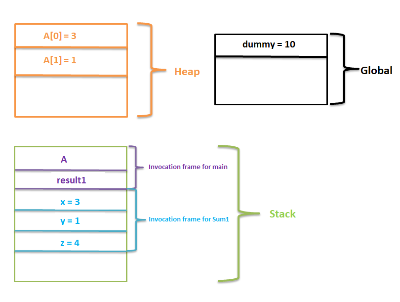

# Algorithms And Complexity

## 01 - Iterative Algorithms

### SumOfNumbersInArray

Main goal is: Finding sum of array of numbers.

Analysis Time & Space Compexity:

- Time complexity of sum metod : T(n) = 3n + 3 ( O(n) )
- Space comlexity of sum metod : S(n) = n + 2

### PowerOfNumber

Main goal is: Compute number of power which is for positive integer. It has been ignored for some base cases.

Analysis Time & Space Compexity:

- Time complexity of power1 metod : T(n) = 3n + 2 ( O(n) )
- Space comlexity of power1 metod : S(n) = 3
- T(n) Time complexity of power2 metod : T(n) = O(logn)
- S(n) Space complexity of power2 metod: S(n) = 4

Resources: https://www.cplusplus.com/doc/tutorial/operators/ , https://www.tutorialspoint.com/cplusplus/cpp_operators.htm ,
https://stackoverflow.com/questions/3904219/what-does-return-0x1-mean#:~:text=0x1%20Is%20just%20a%20hex,a%20different%20representation%20of%200.
https://www.geeksforgeeks.org/write-an-iterative-olog-y-function-for-powx-y/

Tip: In order to understand power2 metod:

   -First  iteration:\
	power = 10 (Decimal) = 1010 (Binary) (even number)\
	power ------------> 1010\
        0x1   ---------------> 0001\
	---------------------------\
  power & 0x1 ----> 0000  so if(0)

   -Second  iteration:\
	power = 5 (Decimal) = 0101 (Binary) (odd number)\
	power ------------> 0101\
        0x1   ---------------> 0001\
	---------------------------\
  power & 0x1 ----> 0001  so if(1)

   -Third  iteration:
	power = 2 (Decimal) = 0010 (Binary) (even number)\
	power ------------> 0010\
        0x1   ---------------> 0001\
	---------------------------\
  power & 0x1 ----> 0000  so if(0)

   -Fourth  iteration:
	power = 1 (Decimal) = 0001 (Binary) (odd number)\
	power ------------> 0001\
        0x1   ---------------> 0001\
	---------------------------\
  power & 0x1 ----> 0001  so if(1)

### PrimalityTest

Main Goal is: Given a positive number "n", return true if it is a prime number otherwise return false.

Analysis Time & Space Compexity:

- Time complexity of isPrime1 metod : T(n) = 3n - 2 ( O(n) )
- Time complexity of isPrime2 metod : T(n) = 3(√n) + 4 ( O(logn) )

### MatrixMultiplication

Main goal is: Given two NxN matrices A and B. Compute the AxB.

Analysis Time & Space Compexity:

- Time complexity of matrixMultiply metod : T(n) =  n^3 + n^2 ( O(n^3) )

### LinearSearch

Main goal is: Given an array of numbers and key. Implement an algorithm that returns the index of the array where the key is stored. If the key does not exist in the array, metod returns -1.

Analysis Time & Space Compexity:

- Best case of time complexity of linearSearch metod : T(n) = 5 ( O(1) )
- Average (expected) case of time complexity of linearSearch metod: T(n) = 1.5n + 2
- Worst case of time complexity of linearSearch metod: T(n) = 3n + 2

### BinarySearch

Main goal is: Given a sorted array of integers and searching for a key. Implement an algorithm that returns the index of the array where the key is stored. If the key does not exist in the array, metod returns -1.

Analysis Time & Space Compexity:

- Best case of time complexity of binarySearch metod : T(n) = 1 ( O(1) )
- Average (expected) case of time complexity of binarySearch metod: T(n) = 1.5 + 2.5logn
- Worst case of time complexity of binarySearch metod: T(n) = 3+ 5logn (logn)

### TimeVsSpaceTradeoff

Main goal is: Given an array of numbers, determine if there are two numbers with the same value.

Analysis Time & Space Compexity:

- T(n) Time complexity of hasDuplicates1 metod : T(n) = O(n^2)
- S(n) Space complexity of hasDuplicates1 metod: S(n) = O(n)

- T(n) Time complexity of hasDuplicates2 metod : T(n) = O(nlogn)
- S(n) Space complexity of hasDuplicates2 metod: S(n) = O(n)

- T(n) Time complexity of hasDuplicates3 metod : T(n) = O(n)
- S(n) Space complexity of hasDuplicates3 metod: S(n) = O(n) (But requires O(n) extra space because of unordered_set)

Resources: http://www.cplusplus.com/reference/unordered_set/unordered_set/, https://www.geeksforgeeks.org/unordered_set-in-cpp-stl/

## 02 - Recursive Algorithms

### MemorySpaceOfProgram

Main goal is: Computing the sum of numbers which are passed to function.

Shortly Briefing: Before starting recursively computing sum of the numbers, We need to understand memory space how it works. Memory space of program dived into 3 parts which are heap, stack and global. Global variables are stored in global and these variables are reachable from any function. Temporary variables are stored in stack. These temporary variables are parameters of functions and local variables of functions. When the functions begin to implement, these temporary variables are allocating in stack. Than the function complete its implemantation, these temporary variables goes to delete from stack. Lastly, variable which are allacoted dynamically stored in heap.

For example the screenshoot which is at above is visualization of the explanation. When Sum1 function is called and than  begin to  implementation of fucntion, local variable and parameters of function are stored in stack temporary. When function return the result of function, local variables and paremeters of functions which are x, y and z will be deleted from stack. At the end, When main function is complete its mission, lacal varaible of main function also will be deleted from stack.

### Addition

Main goal is: Consider the problem of computing the sum of numbers from 1 to n which is passed to function as a paramater.

Analysis Time & Space Compexity:

- T(n) Time complexity of Sum1 metod : if n = 1 (Base case) -> T(1) = 1 -> O(1), if n > 1 T(n) = T(n-1) + 1 -> O(n)
- S(n) Space complexity of Sum1 metod: O(n) , there are "n" invocation frames on the stack at the same time.

- T(n) Time complexity of Sum2 metod : if n = 1 (Base case) -> T(1) = 1 -> O(1), if n > 1 T(n) = T(n-1) + 1 -> O(n)
- S(n) Space complexity of Sum2 metod: O(n) , there are "n" invocation frames on the stack at the same time.
- Recursion  depth of Sum2 method is O(n)

- T(n) Time complexity of Sum3 metod : if n = 1 (Base case) -> T(1) = 1 -> O(1), if n > 1 T(n) = T(n-1) + 1 -> O(n)
- S(n) Space complexity of Sum3 metod: O(n) , there are "n" invocation frames on the stack at the same time.
- Recursion  depth of Sum2 method is O(logn)

### Power

Main goal is:  Compute number of power which is for positive integer by recursively. It has been ignored for some base cases.

Analysis Time & Space Compexity:

- T(n) Time complexity of Power1 metod : if n = 1 (Base case) -> T(1) = 1 -> O(1), if n > 1 T(n) = T(n-1) + 1 -> O(n)
- T(n) Time complexity of Power2 metod : if n = 1 (Base case) -> T(1) = 1 -> O(1), if n > 1 T(n) = T(n/2) + 1 -> O(logn)

### LinearSearch

Main goal is: Given an array of numbers and key. Implement an algorithm that returns the index of the array where the key is stored by recursively. If the key does not exist in the array, metod returns -1.

Analysis Time & Space Compexity:

- Best case of time complexity of ForwardLinearSearch metod : T(n) = O(1)
- Time complexity of ForwardLinearSearch metod: T(n) = O(n)

## 03 - Basic Sorting Algorithms

### SelectionSort

Main goal is: Given a collection of elements, the goal is to rearrange them in some order. Common examples are sorting an array alphabetically or from smallest to largest. In this case, sorting an array from smallest to largest.

Analysis Time & Space Compexity:

-T(n) Time complexity of SelectionSort metod : T(n) = O(n^2)